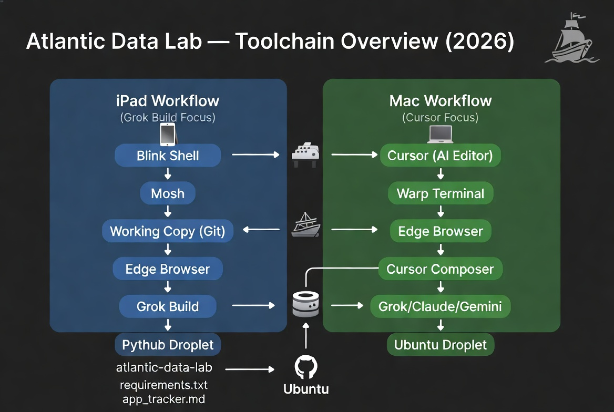

# 🚢 Atlantic Data Lab — Cursor + Mac Workbook v8

**MSC Meraviglia 2026 Edition**  
**Mac + Cursor + Warp + Ubuntu Droplet Focus**

## 📋 App Tracker (Cleaned Up)

| # | App                  | File                | Folder      | Description                                              | Status     |
|---|----------------------|---------------------|-------------|----------------------------------------------------------|------------|
| 1 | Weather Advisor      | `weather.py`        | Essentials  | Live temperature + Lido Deck vs Library recommendation   | ✅ Done    |
| 2 | Utility Kit          | `utils.py`          | Essentials  | Password generator + real-time USD/EUR converter         | ⬜ Todo    |
| 3 | Activity Logger      | `logger.py`         | Essentials  | Daily activity log with Bayesian mood estimation         | ⬜ Todo    |
| 4 | Basic Blackjack      | `bj_simple.py`      | Essentials  | Bust probability calculator for any hand total           | ⬜ Todo    |
| 5 | Pro Blackjack        | `bj_pro.py`         | Analytics   | Stand vs Hit heatmap across all dealer upcards           | ⬜ Todo    |
| 6 | Backgammon           | `backgammon.py`     | Analytics   | Dice probability heatmap + pip counter                   | ⬜ Todo    |
| 7 | Monte Carlo Lab      | `monte_carlo.py`    | Lab         | Pi estimator, Gambler's Ruin, portfolio risk simulator   | ⬜ Todo    |
| 8 | Bayesian Engine      | `bayesian_engine.py`| Lab         | Coin fairness tester + A/B test analyzer                 | ⬜ Todo    |

## Shared Ubuntu Droplet Setup

**Both workflows use the same Ubuntu Droplet.**  
(See detailed steps in the Grok/iPad v8 file)

## Mac + Cursor Setup

1. Open the repo in **Cursor** on your Mac.
2. Connect **Warp** terminal to the Ubuntu Droplet via SSH.
3. Add your Claude, Grok, and Gemini API keys in Cursor Settings.
4. Use **Composer** mode (Cmd + K) for vibe coding.

## Complete Step-by-Step for Each App (Cursor Style)

### 1. Utility Kit (`Essentials/utils.py`)
**Description**: Password generator + real-time USD/EUR converter.

**Step-by-step**:
1. Open `Essentials/utils.py` in Cursor.
2. Press **Cmd + K** (Composer).
3. Use this prompt:
   > Build the Utility Kit in Essentials/utils.py. Include a strong password generator with options and a real-time USD to EUR converter using a free API. Use rich for beautiful cruise-themed output.
4. Review and accept changes.
5. Test on Droplet via Warp: `python Essentials/utils.py`
6. Iterate with follow-up prompts.

### 2. Activity Logger (`Essentials/logger.py`)
**Description**: Daily activity log with Bayesian mood estimation.

**Step-by-step**:
1. Open the file in Cursor.
2. Composer prompt:
   > Build Activity Logger in Essentials/logger.py. Allow daily logging and use simple Bayesian inference for mood estimation. Save to JSON. Add rich summaries.

### 3. Basic Blackjack (`Essentials/bj_simple.py`)
**Step-by-step**:
1. Open the file.
2. Composer prompt:
   > Implement Basic Blackjack bust probability calculator. User inputs hand total and sees bust probability on hit. Make it educational and cruise-themed.

### 4. Pro Blackjack (`Analytics/bj_pro.py`)
**Step-by-step**:
1. Open the file.
2. Composer prompt:
   > Create Pro Blackjack analyzer with full stand vs hit heatmap using numpy and matplotlib. Save the chart as PNG and add rich terminal summary.

### 5. Backgammon (`Analytics/backgammon.py`)
**Step-by-step**:
1. Open the file.
2. Composer prompt:
   > Build Backgammon tool with dice roll probability heatmaps and a pip counter. Add visualizations and cruise theme.

### 6. Monte Carlo Lab (`Lab/monte_carlo.py`)
**Step-by-step**:
1. Open the file.
2. Composer prompt:
   > Implement Monte Carlo Lab with Pi estimation, Gambler's Ruin simulation, and simple portfolio risk. Add matplotlib visualizations.

### 7. Bayesian Engine (`Lab/bayesian_engine.py`)
**Step-by-step**:
1. Open the file.
2. Composer prompt:
   > Build Bayesian Engine with coin fairness tester and simple A/B test analyzer using Bayesian updating. Add rich output and visualizations.

### 8. (Already Done) Weather Advisor

---

**All apps run on the same Ubuntu Droplet.**  
Push changes from Cursor and test via Warp.

**Next**: Say **"Build utils.py"** if you want the full code generated now.

*Version 8 — Complete step-by-step for each app (Cursor/Mac)*